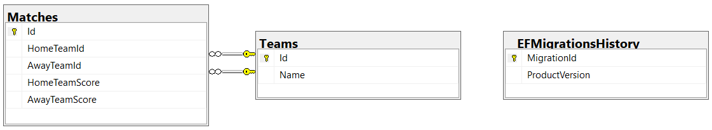
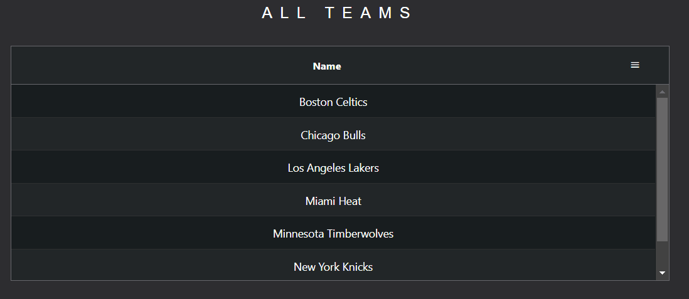

## Description

Web App that shows basketball league results.

## HoopShoot Backend:

Technologies used to create the backend are: .NET 6, EntityFramework, MSSQL Server and Automapper.

UML of the DB relations:

Database is created and seeded (via stored procedure) on project start from EF migrations automatically.\
There's no need to run `update-database` in order to create and run the migrations.

SWAGGER REST API visualisation.

# HoopShoot UI

Technologies used to create the frontend are: Angular 14, Bootstrap 5 and AG grid.

Searching and sorting of results can be done trough AG grid:

## Install Dependancies

Run `npm i` to install the necessary dependencies for the project.

## How to start the application

Set the DB connection string in the appsettings.json file.\
In Visual studio, set HoopShoot.API as default startup project and run it.\
On the UI dir, run `ng serve` to start the dev server. Navigate to `http://localhost:4200/`.

## Running unit tests

Run `ng test` to execute the unit tests via [Karma](https://karma-runner.github.io).
